# 📦 Meksiko Inc. - Inventory & Invoice System


> A streamlined fullstack web application designed to track products, manage stock levels, and generate invoices efficiently. Built with a robust backend architecture and a clean, modern user interface.

**💡 Disclaimer & Project History:** *This repository is an enhanced iteration of my original Final Project for the BNCC (Bina Nusantara Computer Club) Back End Development Bootcamp. I recently revisited this codebase to address the shortcomings of my initial submission. I completely refactored the core backend logic (including implementing proper transaction state management) and upgraded the UI from basic Bootstrap to a polished Tailwind CSS design. This project serves as a showcase of my continuous learning and growth as a software engineer.*

---

# 📌 Project Case Study

As a software developer at **PT Meksiko**, I was tasked by the CEO to build a comprehensive **Product Data Management Website**. The system strictly separates privileges between Administrators and regular Users.

## System Requirements & Logic

### 🔐 Role-Based Access Control (RBAC)

#### Admin

* Exclusive access to inventory management and store analytics.
* Registered manually through database seeding for security purposes.
* Can manage products, categories, invoices, and dashboard analytics.

#### User

* Registered through the web interface.
* Can browse products and generate invoices.

#### Security

Middleware ensures unauthorized users attempting to access Admin routes are safely redirected.

---

### 📦 Inventory Management (Admin)

* Full CRUD operations for Products and Categories.
* One-to-Many relationship between Categories and Products.
* Secure local file handling for product image uploads.
* Input validation for all forms.
* Stock quantity management.
* Product image storage using Laravel Storage.

---

### 🧾 Transaction & Invoice System (User)

#### Shopping Cart Logic

Implementation of Draft/Completed transaction state management.

Users can:

* Add multiple products into a single active invoice.
* Continue shopping before final checkout.
* Complete the invoice when finished.

#### Sequential Invoice Numbering

Automatically generates enterprise-style invoice IDs:

```text
INV-20250610-0001
INV-20250610-0002
INV-20250610-0003
```

Benefits:

* Human-readable
* Prevents collisions
* Easy invoice tracking

#### Dynamic Calculation

The system automatically calculates:

* Product subtotal
* Invoice total
* Total quantity purchased

#### Stock Validation

The system prevents:

* Purchasing products with zero stock
* Purchasing quantities exceeding available stock

---

# 🏗 Database Relationships

The application uses several relational database structures.

## Category → Product

One Category can have many Products.

```text
Category (1)
    │
    └────< Product (Many)
```

---

## User → Invoice

One User can have many Invoices.

```text
User (1)
    │
    └────< Invoice (Many)
```

---

## Invoice → Invoice Detail

One Invoice can contain many purchased Products.

```text
Invoice (1)
    │
    └────< Invoice Detail (Many)
```

---

## Product → Invoice Detail

One Product can appear in many invoice records.

```text
Product (1)
    │
    └────< Invoice Detail (Many)
```

---

## Conceptual ERD

```text
Category
---------
id
name
    │
    │ 1
    ▼
Product
---------
id
category_id
name
price
stock
image

User
---------
id
name
email

Invoice
---------
id
user_id
invoice_number
status

InvoiceDetail
---------
id
invoice_id
product_id
quantity
price
```

---

# 🛠 Tech Stack

### Backend

* Laravel
* PHP

### Database

* MySQL
* Eloquent ORM

### Frontend

* Blade Template Engine
* Tailwind CSS

### Authentication

* Laravel Session Authentication

### File Storage

* Laravel Storage

---

# 🔑 Features & Previews

## 🔐 Authentication

Secure login and registration flow with validation handling.

### Register

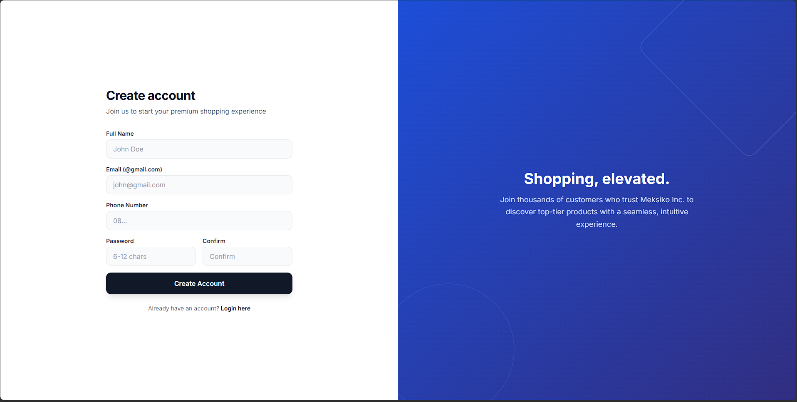

### Login

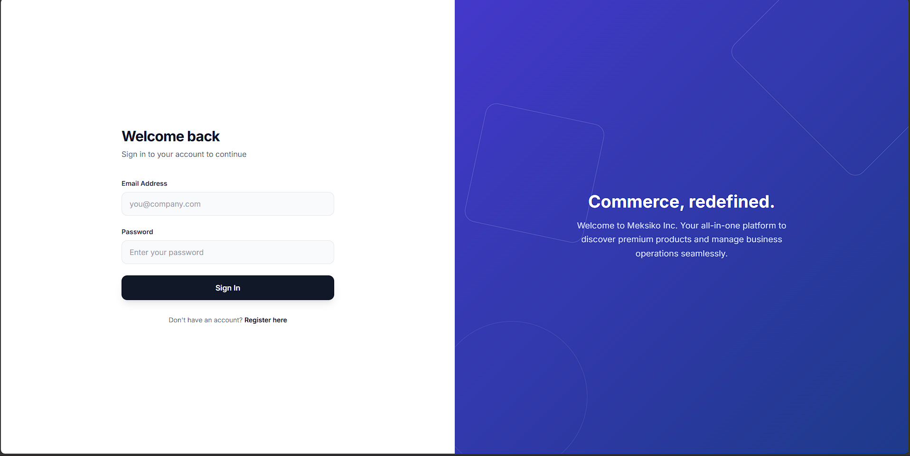

---

## 👨‍💼 Admin Dashboard

### Dashboard Analytics

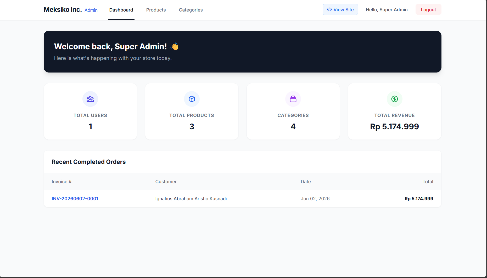

### Invoice Monitoring

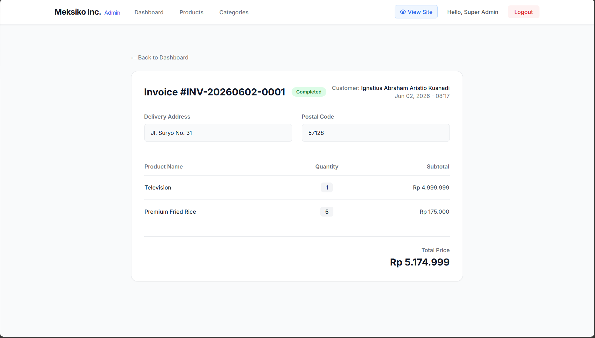

### User Page Monitoring

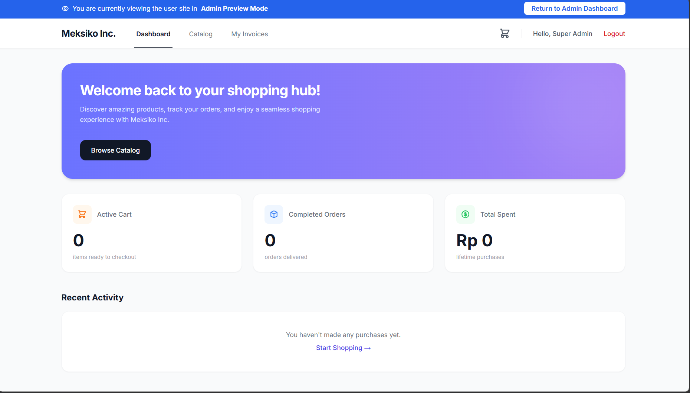

### Product Management

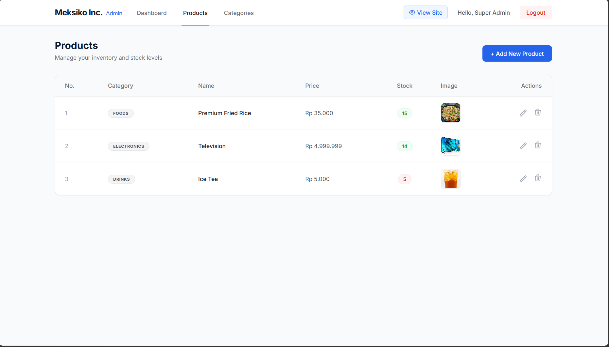

### Add / Edit Product

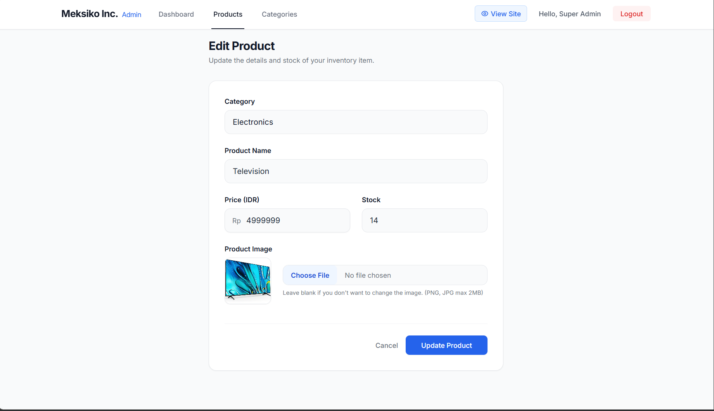

### Category Management

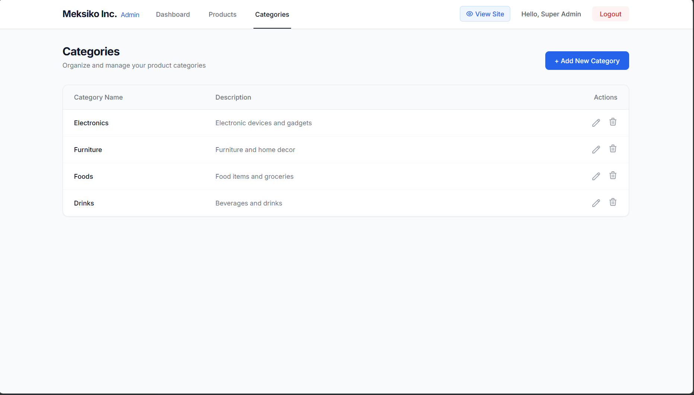

---

## 👤 User Dashboard

### User Dashboard

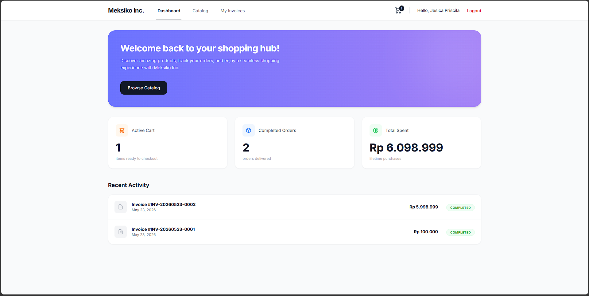

### Product Catalog

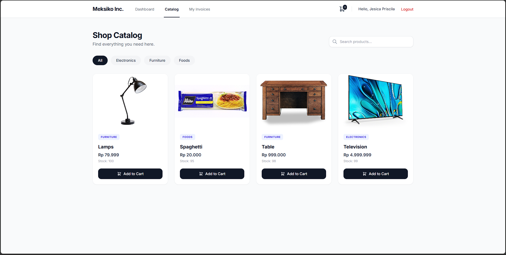

### Active Invoice

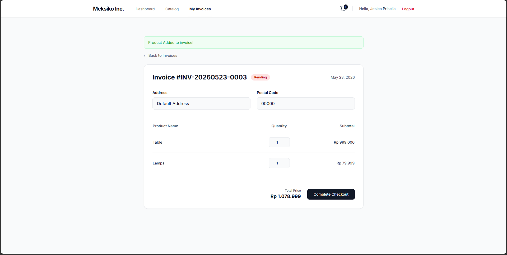

### Invoice History

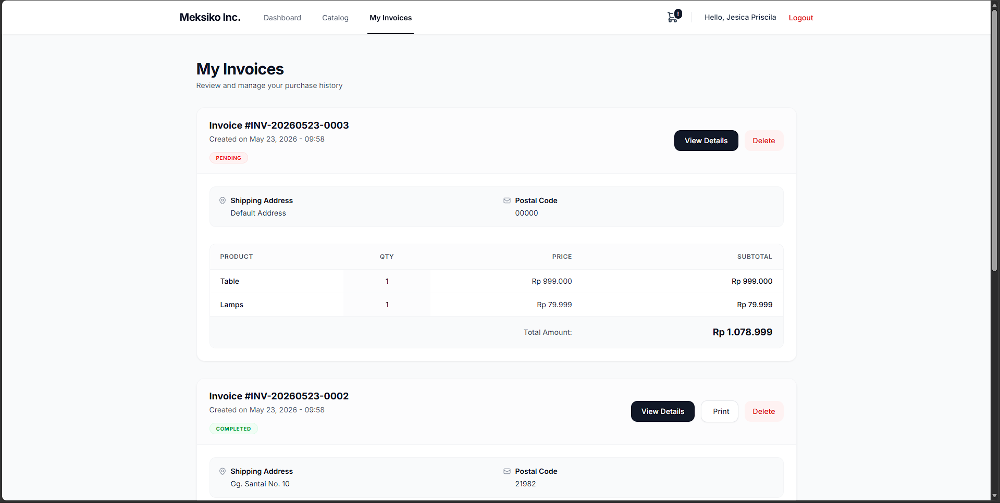

### Invoice Completed

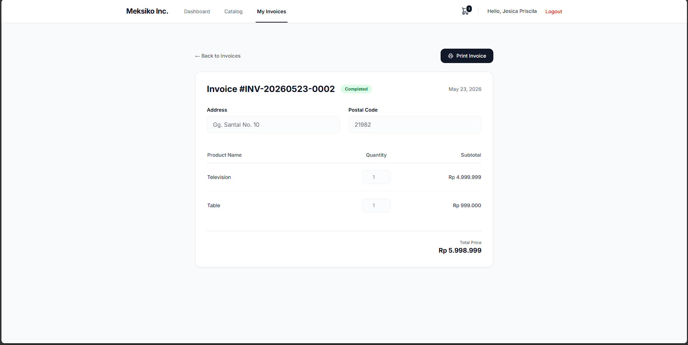

### PDF Invoice Printing

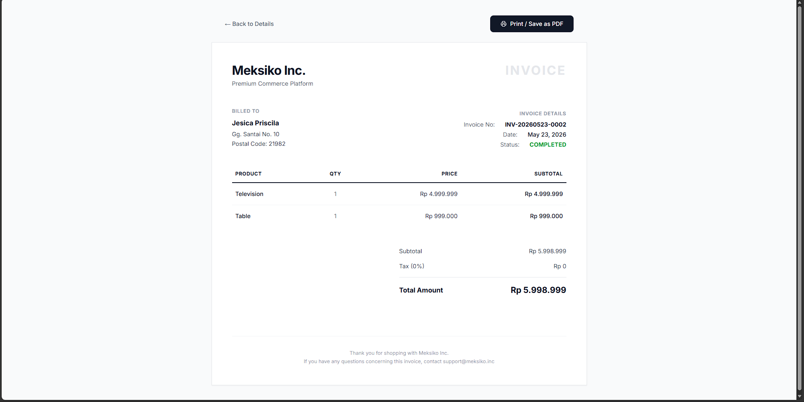

---

# 🎥 Video Demonstration

To see the application in action:

👉 **[Watch the video demo here!](https://youtu.be/2IDoOiJj0DE)**

The video demonstrates:

* Authentication flow
* Inventory management
* Product CRUD
* Category CRUD
* Stock validation
* Shopping cart state management
* Invoice generation
* PDF invoice export

---

# 🚀 Local Setup & Installation

## Prerequisites

Ensure the following software is installed:

* PHP 8.2+
* Composer
* MySQL
* Node.js & NPM
* Git
* XAMPP or Laragon

Verify installation:

```bash
php -v
composer -v
mysql --version
node -v
npm -v
git --version
```

---

## 1. Clone Repository

```bash
git clone https://github.com/abrahamkusnadi/Laravel-Project-BNCC.git

cd Laravel-Project-BNCC
```

---

## 2. Start Database Service

### XAMPP

Start:

* Apache
* MySQL

### Laragon

Start Laragon and ensure MySQL is running.

---

## 3. Create Database

Open phpMyAdmin and create:

```sql
CREATE DATABASE meksiko_inventory;
```

---

## 4. Install PHP Dependencies

```bash
composer install
```

---

## 5. Install Frontend Dependencies

```bash
npm install
```

---

## 6. Environment Configuration

Copy environment file:

```bash
cp .env.example .env
```

Generate application key:

```bash
php artisan key:generate
```

---

## 7. Configure Database

Open `.env`

```env
DB_CONNECTION=mysql
DB_HOST=127.0.0.1
DB_PORT=3306
DB_DATABASE=meksiko_inventory
DB_USERNAME=root
DB_PASSWORD=
```

Adjust values according to your local MySQL configuration.

---

## 8. Run Migration & Seeder

```bash
php artisan migrate --seed
```

This command will:

* Create all database tables
* Generate the Admin account
* Insert initial application data

---

## 9. Link Storage

Required for product image uploads.

```bash
php artisan storage:link
```

---

## 10. Build Frontend Assets

Development mode:

```bash
npm run dev
```

Production build:

```bash
npm run build
```

---

## 11. Start Development Server

```bash
php artisan serve
```

Open:

```text
http://127.0.0.1:8000
```

---

# 🔐 Default Test Credentials

After running the database seeder:

### Admin Account

```text
Email    : admin@gmail.com
Password : admin123
```

---

## 🚀 Roadmap & Potential Enhancements

We are continuously looking to improve this project. Here are some of the planned features for future releases:

- [ ] **Docker Containerization:** Containerize the application and database for isolated, consistent development environments.
- [ ] **Testing Coverage:** Implement comprehensive Unit and Feature Testing to ensure backend reliability.
- [ ] **Email Delivery:** Automated email notifications for invoices and successful checkouts.
- [ ] **Excel Export:** Allow admins to export product catalogs and sales reports to `.xlsx`.
- [ ] **Interactive Dashboards:** Integrate Chart.js for visualizing revenue and user growth analytics.
- [ ] **Barcode Support:** Implement product barcode generation and scanning for faster catalog management.

*Want to contribute? Feel free to pick up any of these tasks and submit a Pull Request!*

---

# 🙏 Acknowledgment

This project was originally developed as the capstone requirement for the **BNCC (Bina Nusantara Computer Club) Back End Development Bootcamp – Calon Praetorian 2025**.

The current version reflects significant self-driven improvements, including:

* Refactored backend architecture
* Improved transaction state management
* Enhanced UI using Tailwind CSS
* Better validation and stock management logic
* Cleaner and more maintainable code structure

This repository represents my growth journey as a software engineer and my commitment to continuously improving previously built systems.
