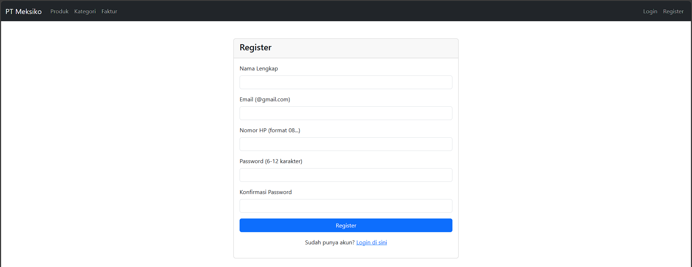
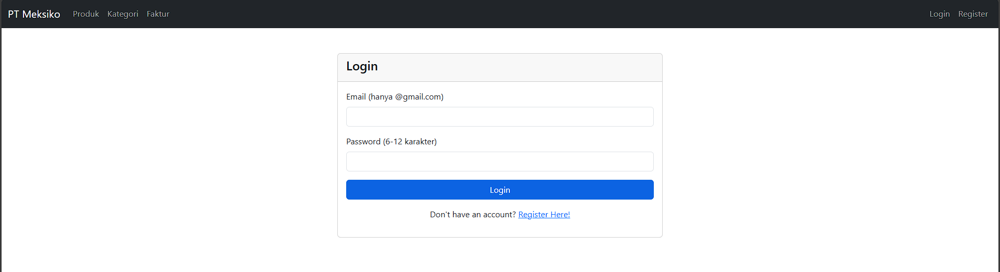
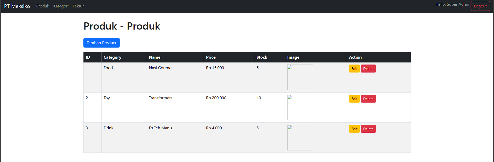
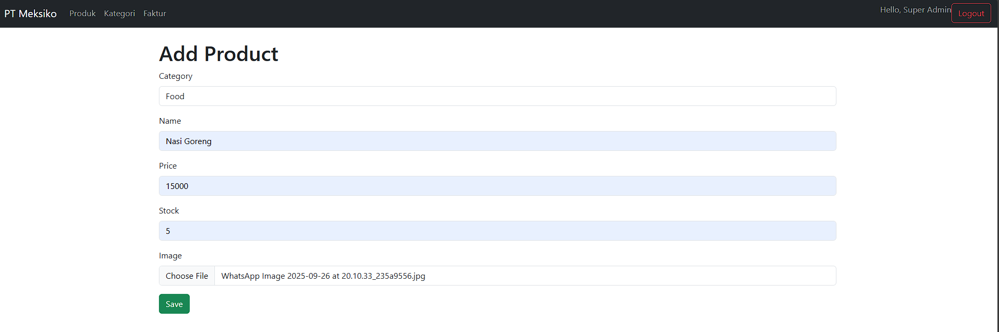
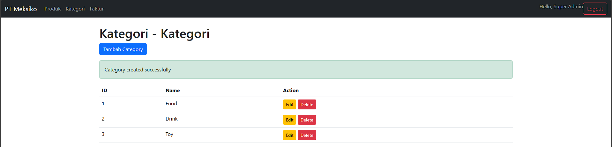
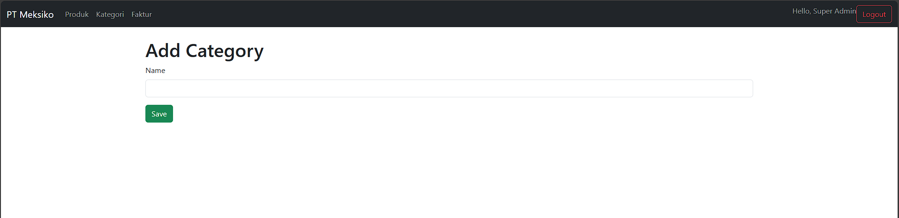
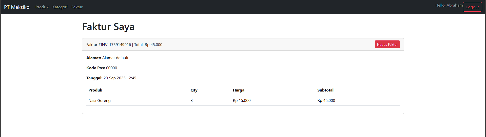
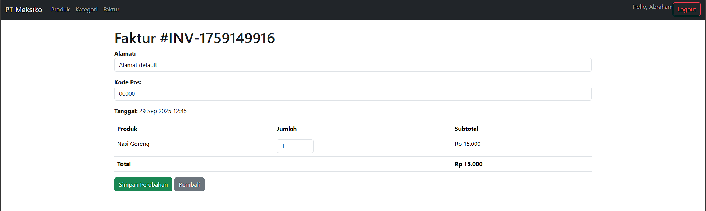
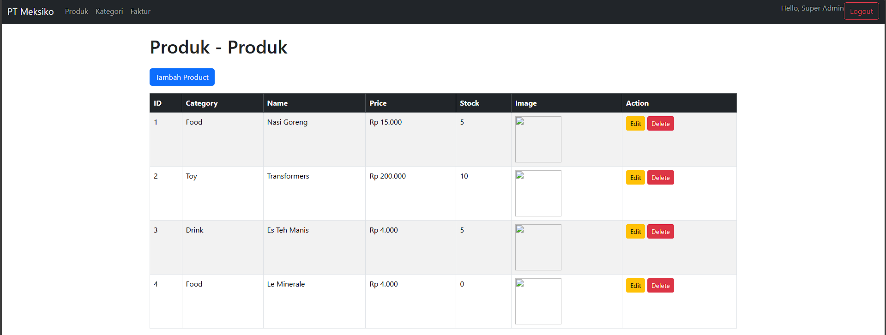

# 🛒 BNCC (Binus Nusantara Computer Club) Laravel Final Project - Inventory & Invoice System

This repository contains my **Final Project for BNCC Bootcamp (Back End Development)**.  
The project is an **Inventory and Invoice Website** built using **Laravel**, following the given case study requirements.

---

## 📌 Project Case

As a software developer at **PT Meksiko**, you are tasked by Mr. Raja (the CEO) to build a **Product Data Management Website**.  

### Requirements:
- Two roles: **Admin** and **User**.  
- **Admin Features:**
  - CRUD (Create, Read, Update, Delete) operations on products.
  - Upload product images.
  - Product data fields:
    - Category (string, required)
    - Product Name (5–80 chars, required)
    - Price (must display with `Rp.` prefix, integer)
    - Quantity (integer)
    - Product Image (file upload)
  - Relationship: 1 Category ↔ Many Products.

- **User Features:**
  - View all products in catalog style.
  - Add products to invoice (cart).
  - Print invoice with:
    - Auto-generated Invoice Number.
    - Product Category.
    - Product Name + Quantity.
    - Shipping Address (10–100 chars).
    - Postal Code (5 digits).
    - Subtotal and Total Price.
    - Save invoice to database.

- **Authentication:**
  - User → Register/Login (form with validation).
  - Admin → Only registered manually in database.

- **Validations:**
  - Middleware: Users trying to access Admin CRUD are redirected.
  - If product stock is 0 → Show validation message *“Barang sudah habis, silahkan tunggu hingga restock”*.  

---

## 🛠 Tech Stack
- **Framework:** Laravel  
- **Database:** MySQL  
- **Frontend:** Blade Templates, Bootstrap  
- **Auth:** Laravel Auth (with middleware)  

---

# 🔑 Features Overview

## Authentication
- User Registration & Login (form validation).
- Admin registration only via database seeding.  

📷 **Screenshot:**  
### Register

### Login

---

## Admin Role
- Full CRUD operations on products.
- Image upload handling.
- Product-Category relationship.  

📷 **Screenshot:**  
### Product

### Add Product

### Category

### Add Category

---

## User Role
- Browse products in catalog view.  
- Add items to invoice (cart).  

📷 **Screenshot:**  
### Example -> Invoices can only be created by users.

---

## Invoice (Faktur)
- Auto-generated invoice number.
- Dynamic subtotal & total price calculation.
- Input shipping address + postal code.
- Save invoice to database.  

📷 **Screenshot:**  
### Invoice

### Add Invoice

---

## Validation & Middleware
- Prevent unauthorized access to Admin pages (Only Admin do CRUD).

📷 **Screenshot:**  
### Example -> Create, Update, Delete for Products

---

## Acknowledgment
This project was developed and completed as part of the **BNCC Bootcamp - Back End Development Final Project** (Bootcamp Calon Praetorian 2025). It is finalized, though there is room for future enhancements.

---

## 🎥 Demo
You can watch the full project demo on YouTube:  
👉 [Click here to watch the demo](https://drive.google.com/file/d/1D6iYUyKTtPdeegFgdwDEKAcRjC8Bq4kz/view?usp=drive_link)
